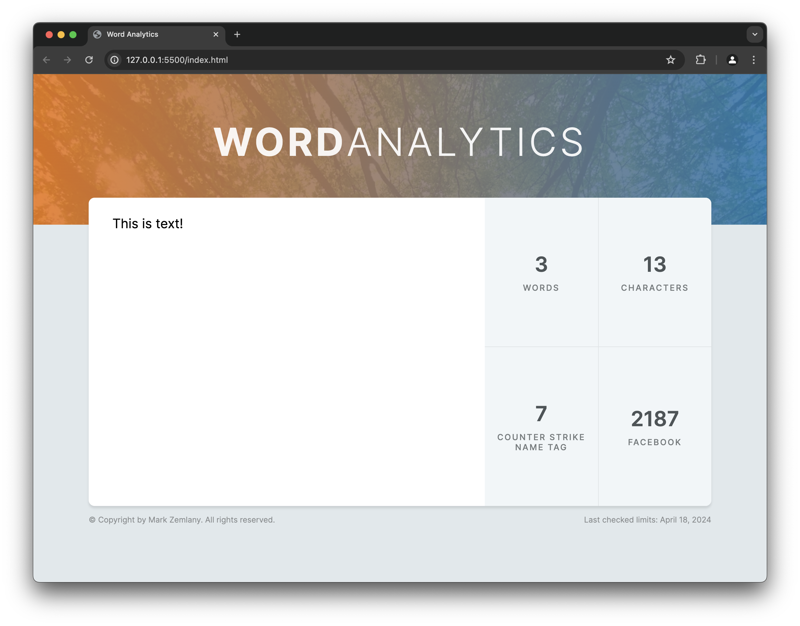
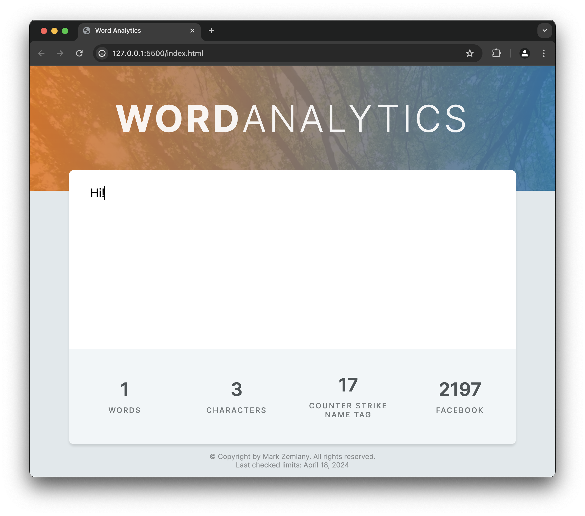

# Word Analytics App Exercise

This project is part of [Byte Grad's](https://bytegrad.com/) Javascript course that I made some changes to. Specifically, I added the Counter Strike Name Tag checker.

This app takes in user input and tells them the character count, the word count, and how many characters can the fit as a name tag or Facebook post.

It is also responsive:

## How to Use

Download the app with he folder and open the HTML page with the browser of your choice. Then, enter your text. That's it!

## Things to Improve

There are some areas where I think this app can be improved. If I have time, I may go back and add these:

- Accessability. I want to test and make sure this is usable in a variety of scenarios.
- Responsive behavior. There is some, but I think it can handle certain screen sizes better
